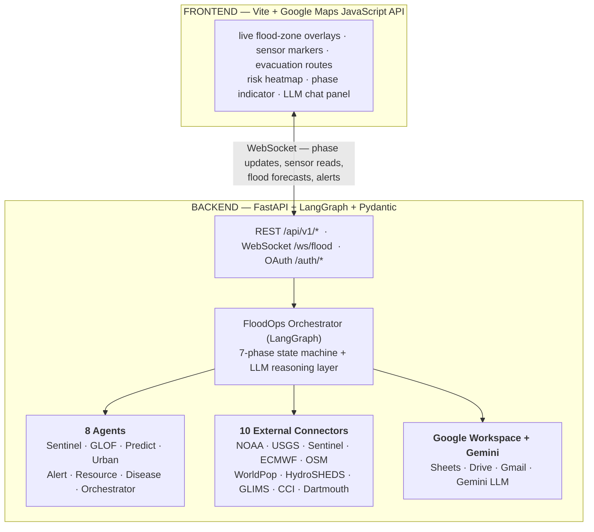

# floodops — Flood Multi-Agent Orchestration System

> Production-grade multi-agent flood monitoring, prediction, and response
> platform — **8 agents** across **7 cascading phases**, **10 external data
> connectors**, **LLM-powered reasoning**, and a **real-time Google Maps
> frontend** for live flood-zone overlays, evacuation routes, sensor
> markers, and risk heatmaps.

`floodops` is a Python + LangGraph backend paired with a Vite + Google Maps
frontend. It ingests data from NOAA, USGS, ESA Copernicus, ECMWF,
HydroSHEDS, GLIMS, OSM, WorldPop, ESA CCI Soil Moisture, the Dartmouth Flood
Observatory, GDACS, ReliefWeb, and **Google's operational Flood Forecasting
API** (the Nature-2024 LSTM model behind [Flood Hub](https://g.co/floodhub));
runs a 7-phase state machine across 8 specialised agents; and surfaces the
result on a live map with an LLM chat panel for situational reasoning.

> ✅ **Built and tested.** The backend boots and demos **with no API key**
> (deterministic mock fallbacks), with **77 offline tests green**. Keys are
> additive — each one promotes a connector or the LLM from mock to live.
> See [`CLAUDE.md`](CLAUDE.md) for the engineering guide and the v2→v5
> capability log.

> 💡 Run `docker compose up` (or `make up`) for a full local demo — no API
> keys needed, all connectors fall back to deterministic mocks.

> 🔒 **Never put a real key in `.env.example`** — it is a committed template.
> Real secrets belong only in `.env` (gitignored). See *Setup & credentials*.

---

## What it does, end to end



---

## The 7 cascading phases

The orchestrator is a LangGraph state machine. Every phase transition is
LLM-justified and audit-logged.

| Phase            | Trigger                                              | What runs                                                      |
|------------------|------------------------------------------------------|----------------------------------------------------------------|
| 1 · MONITOR      | Default steady state                                 | Sentinel scans gauges + satellite SAR + soil-moisture          |
| 2 · WATCH        | Anomaly threshold crossed                            | GLOF + Predict start fanning; LLM interprets anomaly           |
| 3 · ELEVATED     | Probabilistic flood map ≥ medium                     | Urban computes zone-risk + evacuation routes                   |
| 4 · IMMINENT     | Forecast crosses high-confidence threshold           | Alert composes broadcasts; Resource pre-positions supplies     |
| 5 · IMPACT       | Live readings confirm flooding                       | Alerts dispatched (cell broadcast + radio + Gmail)             |
| 6 · RECOVERY     | Levels recede                                        | Disease risk map generated; Resource routes rescue/relief      |
| 7 · POST-MORTEM  | Event closed                                         | Gemini synthesises the sitrep; Drive PDF; Sheets archive       |

Every transition writes an `AuditEntry` (LLM-justified) and pushes a
`phase_transition` event to the WebSocket so the frontend animates the
phase indicator.

---

## The 8 agents

Each agent extends `BaseAgent`, subscribes to its triggering events on the
in-process `EventBus`, and emits structured Pydantic outputs.

| Agent             | Inputs                                                                 | Outputs                                              |
|-------------------|------------------------------------------------------------------------|------------------------------------------------------|
| **Sentinel**      | NOAA, USGS, Sentinel Hub SAR, ESA CCI soil moisture, GLIMS baseline    | `AnomalyAlert`, `SensorReading`                      |
| **GLOF**          | Sentinel-1 SAR coherence, GLIMS area history, HydroSHEDS DEM           | `LakeHealthReport`, `ImpactZone`                     |
| **Predict**       | ECMWF ensemble, NOAA forecast, USGS streamflow, HydroSHEDS hydrography | `ProbabilisticFloodMap`, `FloodForecast`             |
| **Urban**         | OSM buildings + road graph, WorldPop density, Predict probability map  | `ZoneRiskReport`, `RouteSet`                         |
| **Alert**         | Predict / Urban outputs, contact registry                              | `CellBroadcast`, `RadioBroadcast`, Gmail messages    |
| **Resource**      | Urban routes, Sentinel readings, OSM shelters/hospitals                | `LogisticsOrders`, `RescueRoutes`                    |
| **Disease**       | ECMWF temperature/humidity, post-flood standing-water polygons         | `DiseaseRiskMap`, `HotspotList`                      |
| **Orchestrator**  | All of the above                                                       | `AuditEntry`, `StateTransition`, situational reports |

---

## The 10 external connectors

Every connector extends `BaseConnector` (rate limiting, exponential
backoff retry, response caching, credential management, structured
logging).

| # | Connector       | Endpoint                                       | Auth                  | Format            | Library                      |
|---|-----------------|------------------------------------------------|-----------------------|-------------------|------------------------------|
| 1 | NOAA            | `api.weather.gov` + `s3://noaa-goes16/`        | Open (User-Agent)     | GeoJSON, NetCDF4  | `goes2go`, `requests`         |
| 2 | USGS            | `api.waterdata.usgs.gov`                       | Free API key          | JSON, GeoJSON     | `dataretrieval`               |
| 3 | Sentinel Hub    | `sh.dataspace.copernicus.eu/api/v1/`           | OAuth 2.0 client      | GeoTIFF, STAC     | `sentinelhub`                 |
| 4 | ECMWF CDS       | `cds.climate.copernicus.eu/api`                | Personal Token        | GRIB, NetCDF      | `cdsapi`                      |
| 5 | ESA CCI SM      | CEDA FTP / CDS                                 | Open / Token          | NetCDF            | `esa_cci_sm`, `xarray`        |
| 6 | GLIMS           | `glims.org/geoserver/wfs`                      | Open                  | GeoJSON           | `geopandas`, `OWSLib`         |
| 7 | OSM             | `overpass-api.de/api/interpreter`              | Open                  | JSON              | `osmnx`, `overpy`             |
| 8 | WorldPop        | `api.worldpop.org/v1/services/stats`           | Open (1K/day)         | GeoTIFF, JSON     | `worldpoppy`, `rasterio`      |
| 9 | HydroSHEDS      | `hydrosheds.org` (downloads + `mghydro.com`)   | Open                  | Shapefile, GeoTIFF| `geopandas`, `pysheds`        |
| 10| Dartmouth FO    | `floodobservatory.colorado.edu`                | Open                  | CSV, Shapefile    | `pandas`, `geopandas`         |

Each connector implements `health_check()` so the API can report data-source
status on the dashboard.

### Google Flood Forecasting API (v5, the operational Nature-2024 model) 🔑

`connectors/googleflood.py` wraps Google's **Flood Forecasting API**
(`floodforecasting.googleapis.com/v1`) — the operational LSTM of Nearing et
al., *Nature* 627 (2024), free under CC BY 4.0. It is **key-gated and honest**:
without a key, `available` is `False` and every method returns `None` (never a
faked value). Activate by setting `FLOODS_API_KEY` (the name Google's colab/docs
use) or the legacy `GOOGLE_FLOOD_API_KEY` in `.env`.

The connector mirrors the **full surface** of Google's
`Google_Flood_Forecasting_API_Usage_Example` colab, all paginated via
`nextPageToken`:

| Method | What it returns |
|---|---|
| `get_gauges` / `get_flood_status` | gauges + latest per-gauge severity (filtered by `regionCode`, then narrowed to the basin bbox client-side) |
| `query_gauge_forecasts` | quantitative discharge/level forecasts with lead times (Hydrology Model API) |
| `get_gauge_models` | official warning / danger / extreme thresholds |
| `get_significant_events` | clustered major flood events (area + population impact) |
| `get_flash_floods` | urban flash-flood probabilities (24 h) |
| `get_serialized_polygon` | inundation / notification / event KML geometry |

In the pipeline, **Sentinel** cross-validates against it: every status →
`external_hazards` (compound fusion); a SEVERE/EXTREME status in the basin →
an independent AI-model anomaly boost. It is treated as an **independent
forecast signal — never an input** to the local runoff ensemble (paper safety
rule). Verified live against the pilot API (765 Nepal gauges → 178 in the
Bagmati bbox; all endpoints `200`).

---

## LLM reasoning layer

`backend/floodops/llm/` is the intelligence that turns raw data into
human-understandable decisions.

- **`client.py` + `providers.py`** — `FloodLLMClient` is **provider-agnostic**
  via an `LLMProvider` protocol: Anthropic (`claude-opus-4-8`, structured
  output via `messages.parse`), Gemini, Groq / OpenRouter / any
  OpenAI-compatible endpoint, GitHub Models, and a deterministic `NullProvider`
  for keyless runs. `FLOODS_LLM_PROVIDER=anthropic|gemini|groq|…|auto` selects
  the chain. With no key, `available()` is `False` and every reasoning helper
  returns its deterministic mock — **the LLM augments reasoning but never gates
  safety decisions** (alert severity and flood probability are computed without
  it). Supports structured output, ensemble voting, and reflexion.
- **`prompts.py`** — four canonical system prompts:
  - **Anomaly interpreter** — explains *why* a sensor anomaly matters
    given watershed context.
  - **Phase transition justifier** — generates the audit-log entry for
    every phase change.
  - **Situational report** — concise sitrep for emergency managers.
  - **Chat assistant** — answers "what's happening?", "why did we
    escalate?", "what should zone 3 do?" with full state context.
- **`reasoning.py`** — `FloodReasoner` exposes
  `interpret_anomaly`, `justify_transition`, `generate_sitrep`,
  `chat (streaming)`, and `analyze_compound_event` (correlates multiple
  simultaneous alerts).

---

## Google OAuth + Workspace integration

`backend/floodops/auth/` wires the system to Google Sheets, Drive, and Gmail.

- **`oauth.py`** — Authorization Code flow. Scopes: `spreadsheets`,
  `drive.file`, `gmail.send`. Auto-refreshes access tokens; stores
  refresh tokens encrypted.
- **`workspace.py`** — three integration surfaces:
  - **Sheets (data logging)** — appends `SensorReading`,
    `StateTransitionEvent`, `AnomalyAlert` rows. Auto-creates the
    spreadsheet on first use with formatted headers.
  - **Drive (report storage)** — uploads sitrep PDFs and GeoJSON
    snapshots under `FloodOps/Reports/`.
  - **Gmail (alert emails)** — formatted alert + sitrep email delivery.

---

## Real-time Google Maps frontend

`frontend/` is a Vite app driven by the Google Maps JavaScript API.

- **Map base** — dark-theme styled map (Map ID configured in Cloud
  Console) centred on a configurable region (default Kathmandu, GLOF-prone).
- **Layer system** — toggleable overlays:
  1. **Flood zones** (GeoJSON via `google.maps.Data`) — colour-coded by
     probability (green / yellow / orange / red).
  2. **Sensor stations** (`AdvancedMarkerElement`) — river gauges, weather
     stations, SAR coverage; pulse animation on anomaly; InfoWindow with
     reading + z-score.
  3. **Evacuation routes** (`Polyline`) — passable / blocked / at-risk
     colour-coded; animated dashes for direction.
  4. **Glacial lakes** (`Polygon`) — integrity-score colours; click for
     `LakeHealthReport`.
  5. **Disease risk heatmap** (custom `ImageMapType`) — toggleable per
     pathogen (cholera / typhoid / leptospirosis).
  6. **Flood depth grid** (custom tile overlay) — blue gradient by
     predicted depth (0.5 m – 5 m+).
- **WebSocket client** — connects to `/ws/flood`, dispatches updates per
  message type (`phase_transition`, `sensor_update`, `flood_forecast`,
  `evacuation_update`, `alert_dispatch`, `glof_emergency`,
  `disease_risk`, `audit_entry`). Auto-reconnects with exponential
  backoff.
- **Dashboard side panel** — phase indicator, agent statuses (running /
  idle), key metrics (max probability, peak ETA, population at risk),
  scrolling audit feed, layer toggles.
- **LLM chat drawer** — streams answers from `/api/v1/flood/chat`. Renders
  Markdown; supports "explain", "why?", "what should X do?" queries.

---

## REST + WebSocket surface

```
GET   /api/v1/flood/state               current FloodSystemState
GET   /api/v1/flood/phase               current phase + metadata
GET   /api/v1/flood/audit-log           paginated audit entries
GET   /api/v1/flood/agents              agent statuses
POST  /api/v1/flood/simulate            inject mock data for testing
POST  /api/v1/flood/chat                LLM chat (streaming response)
GET   /api/v1/flood/sitrep              generate situation report

GET   /api/v1/map/flood-zones           probability GeoJSON
GET   /api/v1/map/sensors               sensor locations + latest reads
GET   /api/v1/map/evacuation-routes     passable / blocked routes
GET   /api/v1/map/glacial-lakes         lake health polygons
GET   /api/v1/map/disease-risk          disease risk heatmap GeoJSON
GET   /api/v1/map/flood-depth           predicted depth grid GeoJSON
GET   /api/v1/map/urban-zones           zone risk reports

GET   /api/v1/verification/skill        measured forecast skill (±2-day F1) or cold-start prior
GET   /api/v1/basin/thresholds          Weibull-fitted return-period discharge thresholds
GET   /api/v1/hazards/gdacs             live GDACS flood events overlay
GET   /api/v1/alerts/{id}/cap.xml       dispatched alert as CAP 1.2 XML

# Google Flood Forecasting API (v5, key-gated — honest available:false until keyed)
GET   /api/v1/hazards/googleflood                     latest basin flood statuses
GET   /api/v1/hazards/googleflood/forecasts           quantitative discharge/level forecasts
GET   /api/v1/hazards/googleflood/significant-events  clustered major flood events
GET   /api/v1/hazards/googleflood/flash-floods        urban flash-flood probabilities
GET   /api/v1/basin/google-thresholds                 Google's official thresholds (cross-check)

GET   /auth/login                       Google OAuth consent redirect
GET   /auth/callback                    exchange code, store tokens
GET   /auth/status                      is the session authenticated?
POST  /auth/logout                      revoke tokens

WS    /ws/flood                         real-time updates
```

---

## Planned project structure

```
flood_multi-agent_system/
├── flood_agent_specs.jsx                Agent visual spec (existing)
├── flood_multiagent_orchestration.html  Standalone HTML mockup (existing)
├── implementation_plan.md               v2 implementation spec
│
├── backend/
│   ├── pyproject.toml
│   ├── requirements.txt
│   └── floodops/
│       ├── config.py                    Thresholds, API keys, schedules
│       ├── models/                      Pydantic models (state, enums, geo,
│       │                                 sentinel, glof, predict, urban,
│       │                                 alert, resource, disease, audit)
│       ├── queue/event_bus.py           In-process emit / subscribe / direct
│       ├── agents/                      base.py + 7 agent implementations
│       ├── orchestrator/                LangGraph graph, nodes, routing
│       ├── connectors/                  base.py + 10 connectors
│       ├── llm/                         Gemini client, prompts, reasoning
│       ├── auth/                        Google OAuth + Workspace wrappers
│       ├── api/                         FastAPI app + REST + WS + OAuth
│       └── main.py                      Entry point (uvicorn)
│   └── tests/                           state, event bus, agents, connectors,
│                                        models, auth
│
├── frontend/
│   ├── package.json
│   ├── vite.config.js
│   ├── index.html
│   ├── src/
│   │   ├── main.js                      App entry
│   │   ├── map.js                       Google Maps init + layer wiring
│   │   ├── layers.js                    All layer systems
│   │   ├── websocket.js                 Live update client
│   │   ├── dashboard.js                 Phase + metrics + audit panel
│   │   ├── chat.js                      LLM chat drawer
│   │   ├── auth.js                      Google login flow
│   │   └── style.css                    Dark theme + glassmorphism
│   └── public/favicon.svg
│
├── .env.example                         Environment variables template
└── docker-compose.yml                   Optional containerisation
```

---

## Quickstart

```bash
git clone https://github.com/krishddd/floodops-multi-agent-system
cd floodops-multi-agent-system
docker compose up          # full local demo — zero API keys required
```

Backend comes up on `http://localhost:8000`, frontend on `http://localhost:5173`.
Every connector and the LLM fall back to deterministic mocks until you add keys,
so the system boots and demos with nothing configured. Add live data by dropping
keys into `.env` (see *Setup & credentials* below).

Without Docker:

```bash
pip install -r backend/requirements.txt
uvicorn floodops.main:app --reload      # backend
cd frontend && npm install && npm run dev   # frontend
```

## Setup & credentials

You will need accounts / API keys from the following before the system runs
end to end:

0. **None, to start.** The system boots and demos with **zero keys** — every
   connector and the LLM fall back to deterministic mocks. Keys below are
   additive; add them as you need live data. **Put real keys only in `.env`
   (gitignored), never in the committed `.env.example` template.**
1. **Google Cloud Console** — Create a project. Enable Maps JS API,
   Geocoding API, Routes API, Sheets API, Drive API, Gmail API. For live AI
   flood forecasts, also join the **Flood Forecasting API** pilot
   ([waitlist](https://support.google.com/flood-hub/answer/16364306)), enable
   it, and reply to Google with your Cloud Project ID → set `FLOODS_API_KEY`.
2. **OAuth consent screen** — Configure scopes and create a Web Application
   OAuth Client ID.
3. **Google AI Studio** — Get a Gemini API key.
4. **Copernicus Data Space** — Register and create OAuth client credentials
   for Sentinel Hub.
5. **ECMWF CDS** — Register, copy your Personal Access Token, and
   **manually accept the Terms of Use for each dataset** on the CDS site
   before retrieval works.
6. **USGS** — Register at `api.waterdata.usgs.gov/signup/` for a free API
   key (the legacy `waterservices.usgs.gov` endpoint is being
   decommissioned Q1 2027).

`.env.example` (excerpt):

```env
# Google Cloud
GOOGLE_MAPS_API_KEY=your-maps-api-key
GOOGLE_CLIENT_ID=your-oauth-client-id
GOOGLE_CLIENT_SECRET=your-oauth-client-secret
GOOGLE_REDIRECT_URI=http://localhost:8000/auth/callback

# Gemini
GOOGLE_GENAI_API_KEY=your-gemini-api-key

# Google Flood Forecasting API (v5) — the operational Nature-2024 model.
# Free/CC BY 4.0; join the pilot waitlist, enable the API, and reply to Google
# with your Cloud Project ID. FLOODS_API_KEY is Google's canonical name;
# GOOGLE_FLOOD_API_KEY is the legacy alias (wins if both set).
FLOODS_API_KEY=your-flood-forecasting-api-key

# USGS
API_USGS_PAT=your-usgs-api-key

# Sentinel Hub (Copernicus Data Space)
SENTINEL_HUB_CLIENT_ID=your-sh-client-id
SENTINEL_HUB_CLIENT_SECRET=your-sh-client-secret

# ECMWF CDS
ECMWF_CDS_TOKEN=your-cds-personal-access-token

# Frontend
VITE_GOOGLE_MAPS_API_KEY=your-maps-api-key
VITE_WS_URL=ws://localhost:8000/ws/flood
VITE_API_URL=http://localhost:8000/api/v1
```

> The Google Maps free tier covers 10K map loads / month.

---

## Build sequence

| Step | Layer        | What                                                                  |
|------|--------------|-----------------------------------------------------------------------|
| 1    | Setup        | `pyproject.toml`, `requirements.txt`, `.env.example`, `config.py`     |
| 2    | Models       | All Pydantic models + GeoJSON models                                  |
| 3    | Queue        | Event bus with WebSocket broadcast hook                               |
| 4    | Connectors   | `BaseConnector` + all 10 data-source connectors                       |
| 5    | LLM          | Gemini client + prompts + reasoning engine                            |
| 6    | Auth         | OAuth flow + Workspace (Sheets / Drive / Gmail)                       |
| 7    | Agents       | `BaseAgent` + 7 agent implementations                                 |
| 8    | Orchestrator | LangGraph graph, nodes, conditional routing                           |
| 9    | API          | FastAPI app, REST routes, WebSocket handler                           |
| 10   | Frontend     | Vite app, Maps init, layers, WebSocket, dashboard, chat, styling      |
| 11   | Tests        | State transitions, connectors, agents, models, auth                   |
| 12   | Verify       | Mock scenario walkthrough, visual verification, deploy                |

Estimated scope: **~65 new files, 5,000–6,000 lines**.

---

## Verification plan

**Automated**

```bash
# Backend
cd backend && python -m pytest tests/ -v
```

Key test scenarios:
- Full 7-phase state traversal driven by mock connector data.
- Each connector's `health_check()` passes (requires network).
- Event bus `emit` / `subscribe` / `direct_call`.
- Pydantic model validation (probabilities ∈ [0,1], coordinate bounds).
- OAuth refresh-token flow.
- WebSocket broadcast.

**Manual**

1. Run backend (`uvicorn`) + frontend (`npm run dev`).
2. Open the browser — Google Maps should load with the dark theme.
3. Click "Login with Google" → complete OAuth.
4. `POST /api/v1/flood/simulate` to inject a mock scenario.
5. Verify map layers update in real time over WebSocket.
6. Verify the dashboard reflects phase transitions.
7. Use the LLM chat to ask "What's happening?" — expect a streaming sitrep.
8. Confirm rows appear in the linked Google Sheet and a PDF lands in Drive.

---

## Open questions (from the spec)

1. **LLM provider** — the plan defaults to Google Gemini; OpenAI /
   Anthropic fallback is open.
2. **Google Earth Engine** — sources 6 (GLIMS), 9 (HydroSHEDS),
   10 (Dartmouth) are easier via GEE; if no GEE account, the connectors
   fall back to direct file downloads.
3. **Deployment target** — local-first today; Docker / Cloud Run
   scaffolding optional.
4. **Frontend refresh rate** — plan assumes 30-second WebSocket pushes.

---

## Status

✅ **Built and operational through v5.** The backend runs keyless (mock
fallbacks) with **77 offline tests green** (`cd backend && python -m pytest
tests -q`). Capability layers, newest first:

- **v5** — Google Flood Forecasting API connector (full colab surface,
  live-verified), runoff calibration, forecast skill panel.
- **v4** — multi-model LLM fleet, live hazard feeds (GDACS, ReliefWeb), real
  ML (climatology, runoff ensemble, verification loop), CAP 1.2 export,
  SQLite persistence, optional API-key auth.
- **v3** — per-basin return-period flood-frequency analysis, OpenAI-compatible
  LLM providers (Groq / OpenRouter / local).
- **v2** — live WebSocket command deck, observability, keyless real connectors,
  CI/CD.

See [`CLAUDE.md`](CLAUDE.md) for the full engineering guide. The
`implementation_plan*.md` files and the HTML/JSX artefacts capture the original
visual / UX spec.

## License

MIT
